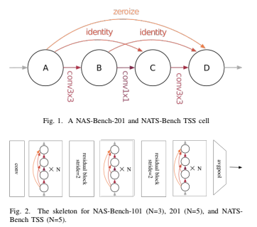

# NAS MachineLearningDeepLearning
Repository for the project of Machine Learning and Deep Learning on NAS algorithm

# Summary

### Introduction
---
One of the most difficult aspects of Neural Networks
is developing their structure. Hand-design requires a large
number of human resources and for this reason NAS algorithms
have been created to automate this process. These methods are
extremely slow, requiring a full training for each observed model.
To expedite this process, various quick-to-compute measures can
be used instead of training to evaluate networks. In this paper, we
evaluate two of these metrics (NASWOT and Synflow) and test
several search algorithms in order to determine the optimum
network configuration for image classification of three distinct
datasets using the Nats-Bench in a matter of minutes.

### Searchspace
---
In our experiments, we explored the NATS-bench search
space. The skeleton is initiated with one 3x3
convolution with 16 output channels and a batch normalization
layer. The main body of the skeleton includes three stacks of
cells connected by a residual block. The shortcut path in this
residual block consists of a 2x2 average pooling layer with a
stride of 2 and a 1x1 convolution. The skeleton ends up with
a global average pooling layer.

### Datasets
---

In this project we use CIFAR-10, CIFAR-100 (Krizhevsky
et al., 2009) and ImageNet-16-120 (Chrabaszcz et al., 2017).

- CIFAR-10 It is a standard image classification dataset and
consists of 60K 32×32 colour images equally divided in
10 classes.

- CIFAR-100 This dataset is just like CIFAR-10. It has the
same images as CIFAR-10 but categorizes each image
into 100 fine-grained classes.
- ImageNet-16-120 is built from the down-sampled variant
of ImageNet (ImageNet16×16). ImageNet-16-120 con-
tains 151.7K training images, 3K validation images, and
3K test images with 120 classes.

### Metrics
---

### Results
---

# Useful Links
- Paper group 8: [Neural Architecture Search](doc/Project8.pdf)
- Upload Colab code on GitHub: [Guide](https://bebi103a.github.io/lessons/02/git_with_colab.html#:~:text=After%20you%20have%20made%20changes,be%20pushed%20to%20your%20repository.)
- NATS BENCH: [repo here](https://github.com/D-X-Y/NATS-Bench)
- NAS Without Training: [repo here](https://github.com/BayesWatch/nas-without-training)
- NAS Without Training Document: [here](doc/NASWithoutTraining.pdf)
- [The definitive guide to NAS](https://www.kdnuggets.com/2019/10/using-neural-networks-design-neural-networks-definitive-guide-understand-neural-architecture-search.html)
- [KDNuggets Guide](https://www.kdnuggets.com/2019/10/research-guide-neural-architecture-search.html)
- [Colab Code](https://colab.research.google.com/drive/1At6oinBpr_ok-8cOu8zHbsAlad8LPL2k?usp=sharing#scrollTo=GSfgib9FkgMu)
# Authors
- [Michele Presti](https://github.com/MichelePresti)
- Francesca Cossu
- Niccolò Dimonte

# Contributing
- AutoML-NASLib Code [repo here](https://github.com/automl/NASLib)
- NASBench201 [repo here](https://github.com/D-X-Y/NAS-Bench-201)
